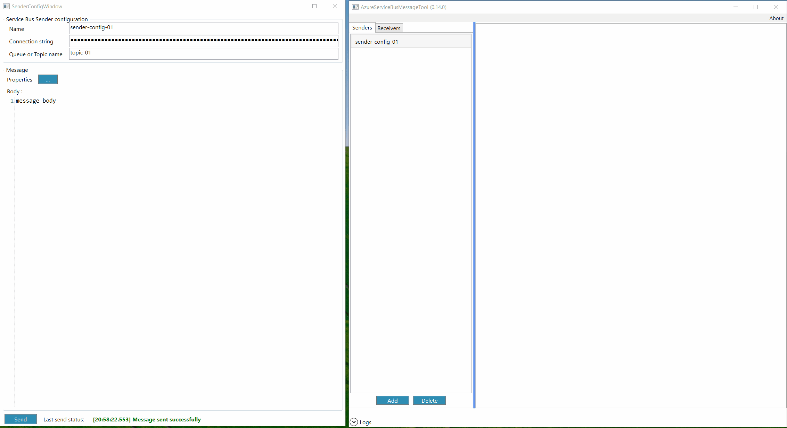


### How to receive message on topic:
1. choose 'Receivers' tab
2. click 'Add' button
3. define receiver configuration Name (can be anything)
4. set Azure Service Bus connection string
5. set topic name
6. define message body
7. push 'Receive' Button and wait until receiver transitions to "Listening" state

