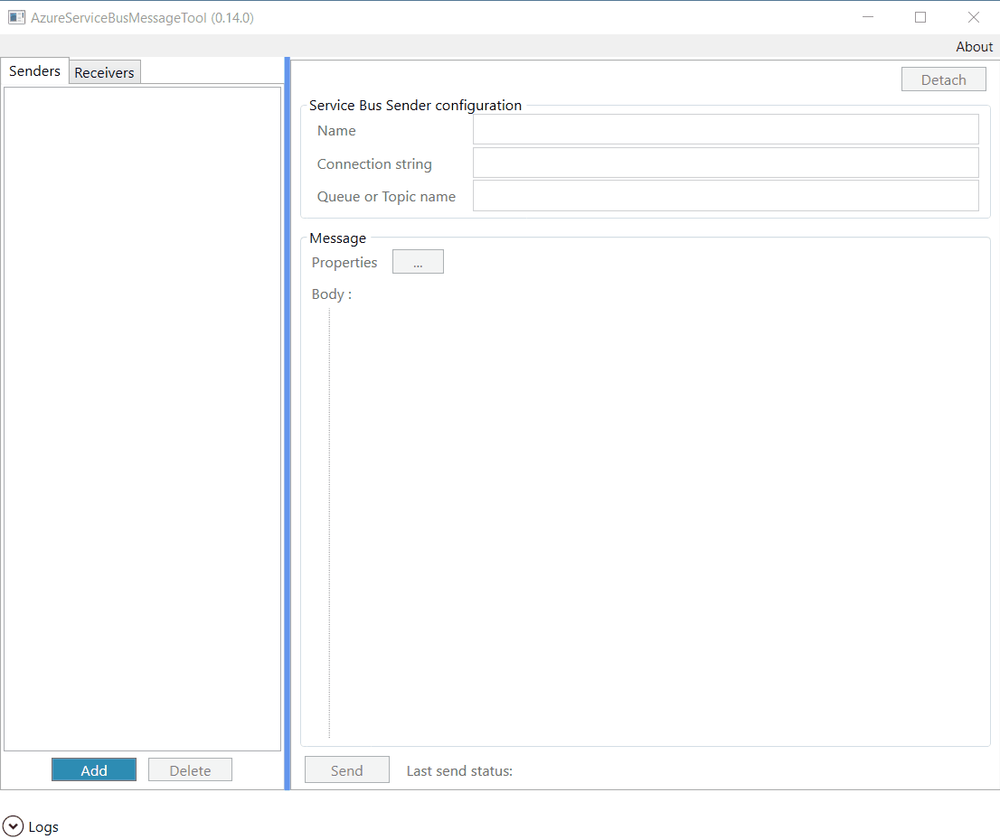
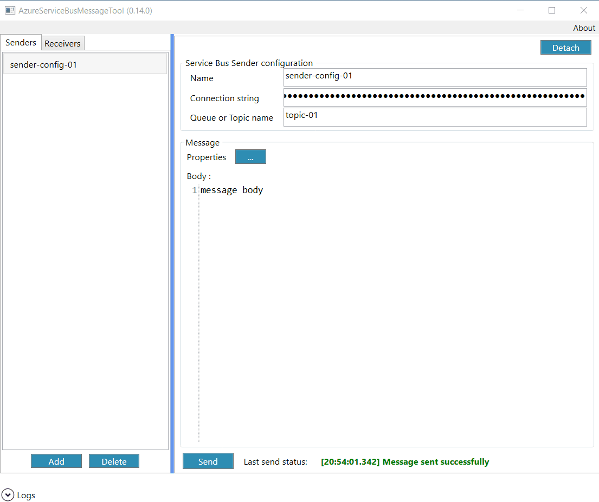


### How to send message:
1. choose 'Senders' tab
2. click 'Add' button
3. define sender configuration Name (can be anything)
4. set Azure Service Bus connection string
5. set queue or topic name
6. define message body
7. push 'Send' Button

### How to diagnose sending errors:
1. Click "Logs" expander
   