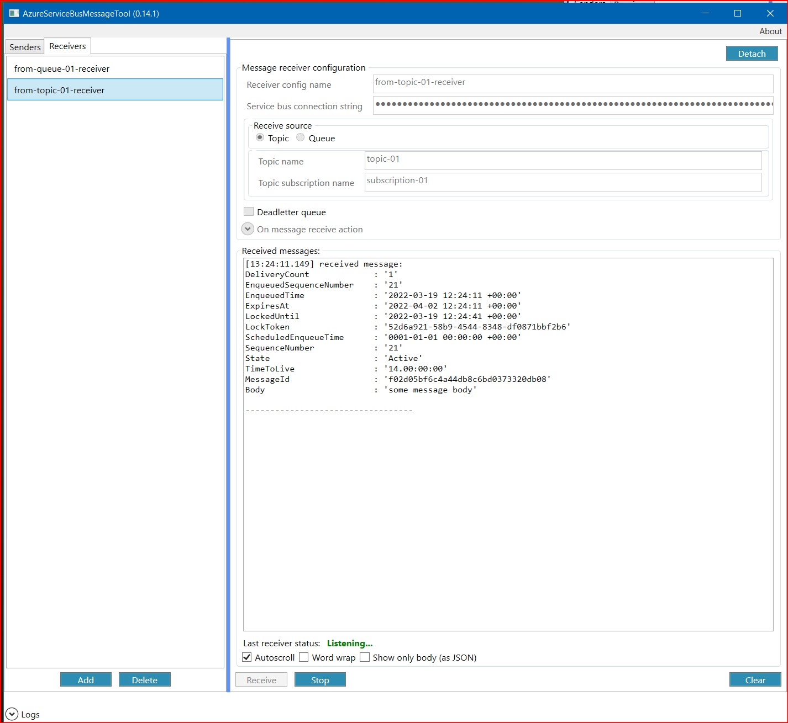

# \<WORK IN PROGRESS\>
## asb-message-tool
Application to send and receive messages from Azure service bus.

- 

### How to
 - [send message](./Doc/sending_messages.md)
 - [receive message](./Doc/receiving_messages.md)

#### 3rd party code used in project : 
- [JsonSettings](https://github.com/Nucs/JsonSettings)
- Exception display window from https://thecolorofcode.com/2019/04/11/net-wpf-global-exception-handler/
- [AvalonEdit](https://github.com/icsharpcode/AvalonEdit)
- [TaskDialog](https://www.codeproject.com/Articles/137552/WPF-TaskDialog-Wrapper-and-Emulator)